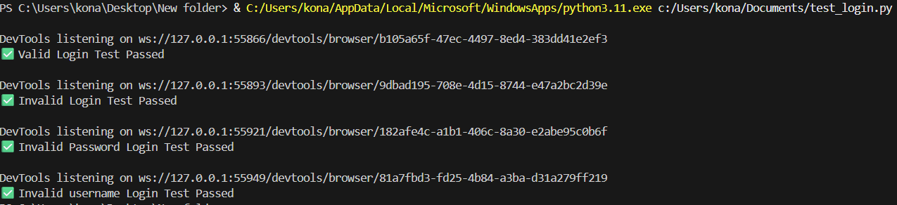
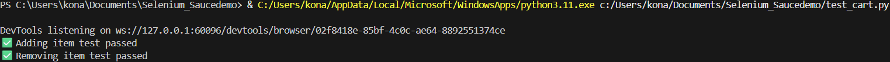
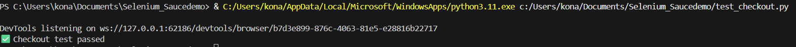
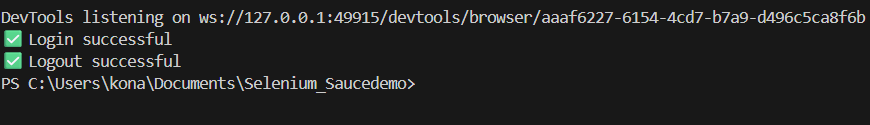

# SauceDemo Selenium QA Project

## Overview
This project contains **automated UI tests** for [SauceDemo](https://www.saucedemo.com/) using:
- Python 3
- Selenium WebDriver
- WebDriver Manager

The goal is to demonstrate **QA automation skills** by covering login, add-to-cart, checkout, and sorting features.

---

## Setup Instructions
### 1. Clone the repository
```bash
git clone https://github.com/Sharmistha2021/saucedemo-selenium.git
cd saucedemo-selenium
```
### 2. Create a virtual environment
```bash
python -m venv venv
venv\Scripts\activate   # Windows
source venv/bin/activate  # Mac/Linux
```
## 3. Install dependencies
```bash
pip install -r requirements.txt
```
### 4. Run tests
```bash
python test_login.py
python test_add_to_cart.py
```

# Folder Structure
```plaintext
saucedemo-selenium/
├── pages/
│   ├── login_page.py
│   ├── cart_page.py
│   └── checkout_page.py
├── manual-test-cases.md
├── test_login.py
├── test_cart.py
├── test_checkout.py
├── requirements.txt
└── README.md

```
# Screenshots 
Login test


cart test


checkout test


logout test

